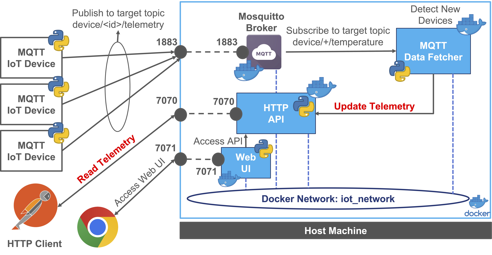
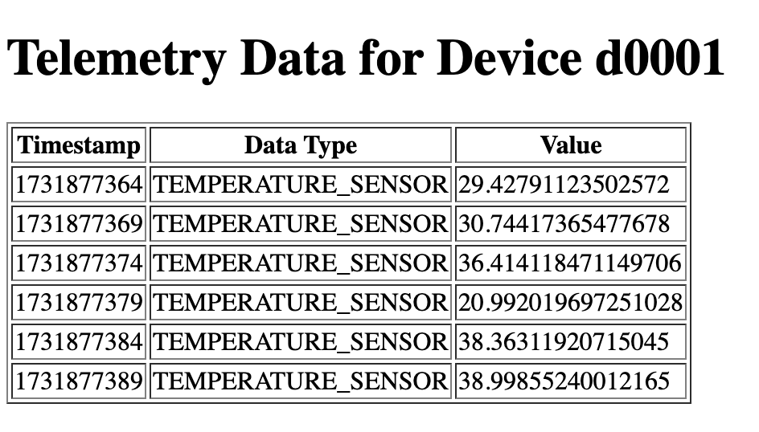
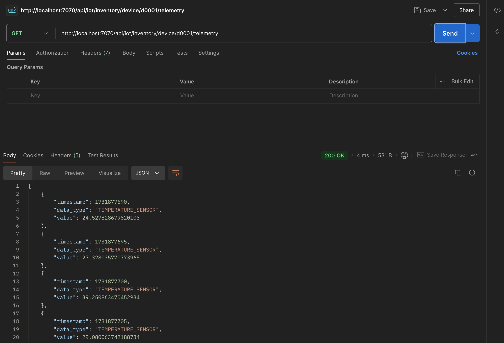

# Microservices IoT Application with Docker - Laboratory

This project is designed as an IoT Microservices Software Architecture Laboratory with the step by step
implementation of a simple IoT application using a microservices and containers. 
The application is structured into different modules, 
each responsible for specific functionalities, ensuring modularity, scalability, and maintainability.

The architecture is divided into 4 distinct containers, 
each responsible for specific functionalities, ensuring modularity, 
scalability, and maintainability.

>This Laboratory is a "simplified" version of the Playground available at 
>[https://github.com/Distributed-IoT-Software-Arch-Course/iot-microservice-arch-playground](https://github.com/Distributed-IoT-Software-Arch-Course/iot-microservice-arch-playground)
>and a "porting" of what has been already done in the previous laboratory on Monolithic IoT Application
>available at [https://github.com/Distributed-IoT-Software-Arch-Course/iot-monolithic-arch-laboratory](https://github.com/Distributed-IoT-Software-Arch-Course/iot-monolithic-arch-laboratory).
>For this reason the explanations of source code is only limited to the 
>variation from the previous laboratory and the new components added in particular with 
>respect to the Docker and Microservices Architecture and the communication between the components.**



The main components of the system are:

- **MQTT Broker**: The MQTT broker is used to receive telemetry data from IoT devices and publish them to the subscribers.
- **IoT Inventory**: The HTTP API is used to manage device telemetry data and interact with the MQTT Data Fetcher.
- **MQTT Data Fetcher**: MQTT to HTTP Inventory Integration: The MQTT Data Fetcher is used to subscribe to an MQTT topic and process incoming messages to interact with the Inventory API.
- **Web UI**: The Web Interface is used to interact with the inventory system and display the device telemetry data.

The outline of the playground is the following:

- [Create a Docker Network](#create-a-docker-network)
- [MQTT Broker - Eclipse Mosquitto](#mqtt-broker---eclipse-mosquitto)
- [Python - IoT Inventory - RESTful HTTP API](#python---iot-inventory---restful-http-api)
- [MQTT Data Fetcher - MQTT to HTTP Inventory Integration](#mqtt-data-fetcher---mqtt-to-http-inventory-integration)
- [Web UI - IoT Inventory Web Interface](#web-ui---iot-inventory-web-interface)
- [MQTT Temperature Sensor Example](#mqtt-temperature-sensor-example)
- [Run & Test the System](#run--test-the-system)
- [Docker Compose](#docker-compose)

## Create a Docker Network

Since we are going to deploy multiple containers, we need to create a dedicated network to allow communication between them.
**In this way containers can communicate with each other using the container name as the hostname.**
This approach will simplify the configuration and the deployment of the services instead of using the IP address of the host machine.

Create a Docker network to allow the containers to communicate with each other:

```bash
  docker network create iot_network
``` 

Listing the networks:

```bash
  docker network ls
```

All the containers that we are going to build and deploy will be connected to this network to allow communication between them.
In order to connect a container to a network, you can use the following parameter `--network iot_network` at the run time:

```bash
  docker run --name=<container_name> --network iot_network <other_options> <image_name>
```

## MQTT Broker - Eclipse Mosquitto

This section provides a guide for setting up and customizing an MQTT broker using Eclipse Mosquitto.
We use the official eclipse-mosquitto Docker image on Docker Hub ([Link](https://hub.docker.com/_/eclipse-mosquitto)), 
and the version for this example is `2.0.12`.

We "customize" our MQTT broker at runtime with the following configurations:

- Local `mosquitto.conf` file: `-v <LOCAL_PATH>/mosquitto.conf:/mosquitto/config/mosquitto.conf`
- Local `data` folder for persistence: `-v <LOCAL_PATH>/data:/mosquitto/data`
- Local `log` folder for easy access: `-v <LOCAL_PATH>/log:/mosquitto/log`
- Port mapping: `-p 1883:1883`
- Restart always: `--restart always`
- Daemon mode: `-d`

Move to the broker folder

```bash
cd mqtt-broker
```

Run the container

```bash
docker run --name=my-mosquitto-broker --network iot_network -p 1883:1883 -v <LOCAL_PATH>/mosquitto.conf:/mosquitto/config/mosquitto.conf -v <LOCAL_PATH>/data:/mosquitto/data -v <LOCAL_PATH>/log:/mosquitto/log --restart always -d eclipse-mosquitto:2.0.12
```

Linux version:

```bash
docker run --name=my-mosquitto-broker --network iot_network -p 1883:1883 -v ${PWD}/mosquitto.conf:/mosquitto/config/mosquitto.conf -v ${PWD}/data:/mosquitto/data -v ${PWD}/log:/mosquitto/log --restart always -d eclipse-mosquitto:2.0.12
```

At the end of the test, you can stop and remove the container using the following commands:

```bash
docker stop my-mosquitto-broker
docker rm my-mosquitto-broker
```

## Python - IoT Inventory - RESTful HTTP API

In this example we have a demo implementation of a simple IoT device telemetry inventory through an HTTP RESTful API. 
It utilizes Flask and Flask RESTful and provides a simple API to manage telemetry Json messages that is going to be 
used by the other components of the system such as the MQTT Data Fetcher and the Web Interface together with
external clients through HTTP requests.

Create and move to the folder `http-api` then create a folder `app` where we are going to put the source code of the application.
This folder then will be copied into the container at the build time.

Inside the `app` folder we have the following folders and files:

- `api_server.py`: The main Python script that implements the RESTful API using Flask and Flask RESTful.
- `conf.yaml`: The configuration file that contains the parameters for the API server.
- `dto`: The folder that contains the Data Transfer Objects (DTO) used to serialize and deserialize the data.
- `persistence`: The folder that contains the data storage for the telemetry data
- `resources`: The folder that contains the resources that are going to be used by the API server (in that case the Telemetry resource)

Inside the `dto` create an empty `__init__.py` file and a `telemetry_message.py` file that contains the following code:

```python
import json

class TelemetryMessage:
    """
    Telemetry Message DTO class
    mapping the telemetry message data structure with:
    - timestamp: timestamp of the telemetry message
    - data_type: type of the telemetry message
    - value: value of the telemetry message
    """
    def __init__(self, timestamp, data_type, value):
        self.timestamp = timestamp
        self.data_type = data_type
        self.value = value

    def to_json(self):
        return json.dumps(self, default=lambda o: o.__dict__)
```

This class is used to map the telemetry message data structure that is going to be used by the API server to serialize and deserialize the data.

Inside the `persistence` create an empty `__init__.py` file and a `data_manager.py` file that contains the following code:

```python
class DataManager:
    """
    DataManager class is responsible for managing the data of the application.
    Abstracts the data storage and retrieval operations.
    In this implementation everything is stored in memory.
    """

    # The data structure to store the telemetry data
    device_timeseries_data = {}

    def add_device_telemetry_data(self, device_id, telemetry_data):
        """Add a new telemetry data for a given device"""
        if device_id not in self.device_timeseries_data:
            self.device_timeseries_data[device_id] = []
        self.device_timeseries_data[device_id].append(telemetry_data)

    def get_telemetry_data_by_device_id(self, device_id):
        """Return the telemetry data for a given device"""
        if device_id in self.device_timeseries_data:
            return self.device_timeseries_data[device_id]
        else:
            return None
```

This class is used to manage the data of the application abstracting the data storage and retrieval operations.

In the `resources` folder create an empty `__init__.py` file and a `telemetry_data_resource.py` file that contains the following code:

```python
from json import JSONDecodeError
from flask import request, Response
from flask_restful import Resource

class TelemetryDataResource(Resource):
    """Resource to handle the Telemetry Data of a specific Device"""

    def __init__(self, **kwargs):
        # Inject the DataManager instance
        self.data_manager = kwargs['data_manager']

    def get(self, device_id):
        """GET Request to retrieve the Telemetry Data of a target device"""

        device_telemetry_data = self.data_manager.get_telemetry_data_by_device_id(device_id)

        if device_telemetry_data is not None:
            result_location_list = []

            # Iterate over the telemetry data to build a serializable telemetry data list
            # transforming the telemetry data into a dictionary. Then it will be Flask to serialize it into JSON
            for telemetry_data in device_telemetry_data:
                #result_location_list.append(telemetry_data.__dict__)
                result_location_list.append(telemetry_data)

            return result_location_list, 200  # return data and 200 OK code
        else:
            return {'error': "Device Not Found !"}, 404

    def post(self, device_id):
        try:

            # The boolean flag force the parsing of POST data as JSON irrespective of the mimetype
            telemetry_data_dict = request.get_json(force=True)

            # Deserialize the payload into a TelemetryMessge object
            #telemetry_message = TelemetryMessage(**telemetry_json_data)

            # Add the telemetry data to the data manager
            self.data_manager.add_device_telemetry_data(device_id, telemetry_data_dict)

            return Response(status=201)  # return 201 Created

        except JSONDecodeError:
            return {'error': "Invalid JSON ! Check the request"}, 400
        except Exception as e:
            return {'error': "Generic Internal Server Error ! Reason: " + str(e)}, 500
```

This class is used to handle the Telemetry Data of a specific Device through the HTTP API.
It implements the GET and POST methods to retrieve and add telemetry data for a specific device.
Please refer to the source code of previous laboratories for a complete explanation of the code.

In the `app` folder create an `api_server.py` file that contains the following code:

```python
from flask import Flask
from flask_restful import Api
from persistence.data_manager import DataManager
from resources.telemetry_data_resource import TelemetryDataResource
import yaml

# Default Values
CONF_FILE_PATH = "conf.yaml"
DEFAULT_ENDPOINT_PREFIX = "/api/v1/iot/inventory"

# Default Configuration Dictionary
configuration_dict = {
    "rest":{
        "api_prefix": DEFAULT_ENDPOINT_PREFIX, 
        "host": "0.0.0.0",
        "port": 7070
    }
}

# Read Configuration from target Configuration File Path
def read_configuration_file():
    global configuration_dict

    with open(CONF_FILE_PATH, 'r') as file:
        configuration_dict = yaml.safe_load(file)

    return configuration_dict

# Read Configuration file
configuration_dict = read_configuration_file()

print("Read Configuration from file ({}): {}".format(CONF_FILE_PATH, configuration_dict))

app = Flask(__name__)
api = Api(app)

print("Starting HTTP RESTful API Server ...")

data_manager = DataManager()

# Add Resources and Endpoints
api.add_resource(TelemetryDataResource, configuration_dict['rest']['api_prefix'] + '/device/<string:device_id>/telemetry',
                      resource_class_kwargs={'data_manager': data_manager},
                      endpoint="device_telemetry_data",
                      methods=['GET', 'POST'])

if __name__ == '__main__':

    # Run the Flask Application
    app.run(host=configuration_dict['rest']['host'], port=configuration_dict['rest']['port'])  # run our Flask app
```

This script is the main script that implements the RESTful API using Flask and Flask RESTful.
Then we can create the `conf.yaml` file that contains the configuration for the API server:

```yaml
rest:
  api_prefix: "/api/v1/iot/inventory"
  host: "0.0.0.0"
  port: 7070
```

Now we can move to the http-api folder and create the last files required for building the container.
The first one is the `requirements.txt` file that contains the Python dependencies required for the application:

```text
flask_restful~=0.3.10
Flask~=2.3.2
requests~=2.31.0
pyyaml~=6.0.1
```

Then we can create the configuration file for the container that contains the parameters for the API server.

```yaml
rest:
  api_prefix: "/api/v1/iot/inventory"
  host: "0.0.0.0"
  port: 7070
```

We can now create the `Dockerfile` file define the build of the container:

```Dockerfile
FROM python:3.9-slim-buster

# Copy Application Files & Requirements to /app
COPY ./app /app
COPY requirements.txt /app/requirements.txt

# Set the target container working directory to /app
WORKDIR /app

# Install Python Application Requirements
RUN pip3 install -r requirements.txt

# Exposed Port of the API Server
EXPOSE 7070

# Python Container Application Configurations
ENV PYTHONPATH "/app/"
ENV PYTHONUNBUFFERED 1

# Run the target application
CMD [ "python3", "api_server.py" ]
```

After that, we can build the container:

```bash
docker build -t http_iot_inventory_api_lab:0.1 .
```

Run the container

```bash
docker run --name=http-inventory-api-lab --network iot_network -p 7070:7070 --restart always -d http_iot_inventory_api_lab:0.1
```

If necessary we can also run with a different configuration

```bash
docker run --name=http-inventory-api-lab --network iot_network -p 7070:7070 -v ${PWD}/test_conf.yaml:/app/conf.yaml --restart always -d http_iot_inventory_api_lab:0.1
```

At the end of the test, you can stop and remove the container using the following commands:

```bash
docker stop http-inventory-api-lab
docker rm http-inventory-api-lab
```

## MQTT Data Fetcher - MQTT to HTTP Inventory Integration

Now that we have the MQTT Broker and the HTTP Inventory API running, we can implement the MQTT Data Fetcher.
This second Python application implements the integration between an MQTT client and an HTTP Inventory API using Paho MQTT library.
The main goal is to subscribe to an MQTT topic and process incoming messages to interact with the Inventory API.
Main implemented features are:

- MQTT Subscription to the topic "device/+/temperature"
- Message Processing with HTTP requests
- POST Request to register new telemetry data

In order to build the container, move to the target folder

In the main project folder create a folder named `data-fetcher` and move to it.
Then create a folder named `app` where we are going to put the source code of the application.

In the new `app` folder create a configuration file named `fetcher_conf.yaml` that contains the following parameters:

```yaml
broker_ip: "127.0.0.1"
broker_port: 1883
target_telemetry_topic: "device/+/temperature"
device_api_url: "http://127.0.0.1:7070/api/v1/iot/inventory/device"
```

This is the local configuration file that contains the parameters for the MQTT Data Fetcher.
When the container is going to be run, we will overwrite this file with the target configuration file containing the parameters for the container
targeting the deployment environment with name of the services instead of the IP address in order to maximize the flexibility 
and the portability of the application.

Create a file `data_fetcher.py` in the `app` folder that contains the following code:

```python
import json
import requests
import paho.mqtt.client as mqtt
import yaml

# Default Values
CONF_FILE_PATH = "fetcher_conf.yaml"

# Default Configuration Dictionary
configuration_dict = {
    "broker_ip": "127.0.0.1",
    "broker_port": 1883,
    "target_telemetry_topic": "device/+/temperature",
    "device_api_url": "http://127.0.0.1:7070/api/v1/iot/inventory/location/l0001/device"
}

# Read Configuration from target Configuration File Path
def read_configuration_file():
    global configuration_dict

    with open(CONF_FILE_PATH, 'r') as file:
        configuration_dict = yaml.safe_load(file)

    return configuration_dict

configuration_dict = read_configuration_file()

print("Read Configuration from file ({}): {}".format(CONF_FILE_PATH, configuration_dict))

# MQTT Broker Configuration
mqtt_broker_host = configuration_dict["broker_ip"]
mqtt_broker_port = configuration_dict["broker_port"]
mqtt_topic = configuration_dict["target_telemetry_topic"]

# HTTP API Configuration
api_url = configuration_dict["device_api_url"]

def on_connect(client, userdata, flags, rc):
    print("Connected to MQTT Broker with result code " + str(rc))
    client.subscribe(mqtt_topic)

def on_message(client, userdata, msg):

    if mqtt.topic_matches_sub(mqtt_topic, msg.topic):
        try:

            payload_dict = json.loads(msg.payload.decode())
            device_id = msg.topic.split('/')[1]

            # Check if the device exists in the inventory
            telemetry_device_url = f"{api_url}/{device_id}/telemetry"

            print(f'Telemetry for Device: {device_id} Sending HTTP POST Request to: {telemetry_device_url}')

            device_telemetry_payload = {
                "data_type": payload_dict["type"],
                "value": payload_dict["value"],
                "timestamp": payload_dict["timestamp"]
            }

            create_device_response = requests.post(telemetry_device_url, json=device_telemetry_payload)

            if create_device_response.status_code == 201:
                print(f"Device Telemetry {device_id} registered successfully.")
            else:
                print(f"Failed to register telemetry {device_id}. Status code: {create_device_response.status_code} Response: {create_device_response.text}")

        except Exception as e:
            print(f"Error processing MQTT message: {str(e)}")

# Create MQTT client
client = mqtt.Client()
client.on_connect = on_connect
client.on_message = on_message

# Connect to MQTT Broker
client.connect(mqtt_broker_host, mqtt_broker_port, 60)

# Start the MQTT loop
client.loop_forever()
```

This script is the main script that implements the MQTT Data Fetcher that subscribes to an MQTT topic and processes incoming messages to interact with the Inventory API.
When a new message is received, the script processes the message and sends an HTTP POST request to the Inventory API to register the telemetry data.
This file is really similar to the one used in the previous laboratory with the main difference
that in that case the script instead of using a local persistence system to store the telemetry data, interacts with the HTTP Inventory API.

Now we can move to the data-fetcher folder and create the last files required for building the container.
A `requirements.txt` is useful to define the Python dependencies required for the application and then copy it 
into the container at the build time.

```text
requests~=2.31.0
pyyaml~=6.0.1
paho-mqtt~=1.6.1
```

Then we can create the configuration file for the container that contains the parameters for the MQTT Data Fetcher.
The file is named `target_fetcher_conf.yaml` and contains the following parameters:

```yaml
broker_ip: "my-mosquitto-broker"
broker_port: 1883
target_telemetry_topic: "device/+/temperature"
device_api_url: "http://http-inventory-api-lab:7070/api/v1/iot/inventory/device"
```

>**Note:** During the development of the application we are not in the docker environment, 
> so we can use the local configuration file to test the application.
>Only at the deployment time, we need to pass the configuration file to the container.

In this case we use `http://http-inventory-api:7070/api/v1/iot/inventory/location/l0001/device` instead for 
example of `http://192.168.1.123:7070/api/v1/iot/inventory/location/l0001/device` since it is more flexible and
we can use the container name as the hostname to refer to the other containers in the same network.

Furthermore, we cannot use `http://127.0.0.1:7070/api/v1/iot/inventory/location/l0001/device` because we are in a docker environment
and not in the local environment during development phases or internally to the container and the `loopback` refers to the host machine 
instead of the container itself.

At the run time we can pass the configuration file to the container using the `-v` mounting the local 
file with the configuration (`target_fetcher_conf.yaml`) to the container file (`fetcher_conf.yaml`) overwriting the default one.

Now we can create the `Dockerfile` file define the build of the container:

```Dockerfile
FROM python:3.9-slim-buster

# Copy Application Files & Requirements to /app
COPY ./app /app
COPY requirements.txt /app/requirements.txt

# Set the target container working directory to /app
WORKDIR /app

# Install Python Application Requirements
RUN pip3 install -r requirements.txt

# Python Container Application Configurations
ENV PYTHONPATH "/app/"
ENV PYTHONUNBUFFERED 1

# Run the target application
CMD [ "python3", "data_fetcher.py" ]
```

To build the container

```bash
docker build -t mqtt_data_fetcher_lab:0.1 .
```

In this case we cannot run the container without the configuration file because the container needs to 
information about the MQTT broker and the HTTP Inventory API to interact with them, so we need to configuration file at runtime.

Run the container with the target configuration file:

```bash
docker run --name=mqtt_data_fetcher_lab --network iot_network -v <LOCAL_PATH>/target_fetcher_conf.yaml:/app/fetcher_conf.yaml --restart always -d mqtt_data_fetcher_lab:0.1
```

Linux version:

```bash
docker run --name=mqtt_data_fetcher_lab --network iot_network -v ${PWD}/target_fetcher_conf.yaml:/app/fetcher_conf.yaml --restart always -d mqtt_data_fetcher_lab:0.1
```

At the end of the test, you can stop and remove the container using the following commands:

```bash
docker stop mqtt_data_fetcher_lab
docker rm mqtt_data_fetcher_lab
```

## Web UI - IoT Inventory Web Interface

Now that we have the MQTT Broker, the HTTP Inventory API, and the MQTT Data Fetcher running, we can implement the Web Interface.
This component provides the user interface for the system, allowing users to interact with the 
application through a web browser. It displays location and device information through dedicated pages and tables.

The implementation is based on the following Python Frameworks 

- Flask: https://flask.palletsprojects.com/en/2.0.x/

The web interface interacts with the IoT Inventory API to retrieve and display the information.
The interaction is based on HTTP requests to the API endpoints.

In the main project folder create a folder named `web-ui` and move to it.
Then create a folder named `app` where we are going to put the source code of the application.

Inside the `app` folder create a `templates` folder that contains the HTML templates for the web interface.
In our case, we have only one template named `telemetry.html` that contains the following code:

```html
<!DOCTYPE html>
<html lang="en">
<head>
    <meta charset="UTF-8">
    <title>Telemetry Data for Device {{ device_id }}</title>
</head>
<body>
    <h1>Telemetry Data for Device {{ device_id }}</h1>
    
    <table border="1">
        <tr>
            <th>Timestamp</th>
            <th>Data Type</th>
            <th>Value</th>
        </tr>
        
        <tr>
            <td>{{ telemetry.timestamp }}</td>
            <td>{{ telemetry.data_type }}</td>
            <td>{{ telemetry.value }}</td>
        </tr>
        
    </table>
    
    <p>No telemetry data available for this device.</p>
    
</body>
</html>
```

In order to understand the meaning and structure of this code refers
to the previous laboratory where the Web Interface was implemented in particular the Monoithic IoT Application and 
the associated Playground and Laboratory repositories.

In the `app` folder create a `web_server.py` file that contains the following code:

```python
import requests
from flask import Flask, request, render_template
import os
import yaml
import threading


class WebServer:

    def __init__(self, config_file:str):

        # Server Thread
        self.server_thread = None

        # Save the configuration file
        self.config_file = config_file

        # Get the main communication directory
        main_app_path = ""

        # Construct the file path
        template_dir = os.path.join(main_app_path, 'templates')

        # Set a default configuration
        self.configuration_dict = {
            "web": {
                "host": "0.0.0.0",
                "port": 7071,
                "api_base_url": "http://127.0.0.1:7070/api/v1/iot/inventory"
            }
        }

        # Read Configuration from target Configuration File Path
        self.read_configuration_file()

        # Create the Flask app
        self.app = Flask(__name__, template_folder=template_dir)

        # Add URL rules to the Flask app mapping the URL to the function
        self.app.add_url_rule('/device/<string:device_id>/telemetry', 'telemetry', self.telemetry)

    def read_configuration_file(self):
        """ Read Configuration File for the Web Server
         :return:
        """

        # Get the main communication directory
        main_app_path = ""

        # Construct the file path
        file_path = os.path.join(main_app_path, self.config_file)

        with open(file_path, 'r') as file:
            self.configuration_dict = yaml.safe_load(file)

        print("Read Configuration from file ({}): {}".format(self.config_file, self.configuration_dict))

    def telemetry(self, device_id):
        """ Get telemetry data for a specific device and render the telemetry.html template"""
        telemetry_data = self.http_get_device_telemetry(device_id)
        print(telemetry_data)
        return render_template('telemetry.html', telemetry_data=telemetry_data, device_id=device_id)

    def http_get_device_telemetry(self, device_id):
        """ Get all locations from the remote server over HTTP"""

        # Get the base URL from the configuration
        base_http_url = self.configuration_dict['web']['api_base_url']
        target_url = f'{base_http_url}/device/{device_id}/telemetry'

        # Send the GET request
        response_string = requests.get(target_url)

        # Return the JSON response
        return response_string.json()

    def devices(self, location_id):
        """ Get all devices for a specific location and render the devices.html template"""
        device_list = self.http_get_device_list(location_id)
        return render_template('devices.html', devices=device_list, location_id=location_id)

    def http_get_device_list(self, location_id):
        """ Get all devices for the target location_id from the remote server over HTTP"""

        # Get the base URL from the configuration
        base_http_url = self.configuration_dict['web']['api_base_url']
        target_url = f'{base_http_url}/location/{location_id}/device'

        # Send the GET request
        response_string = requests.get(target_url)

        # Return the JSON response
        return response_string.json()


    def run_server(self):
        """ Run the Flask Web Server"""
        self.app.run(host=self.configuration_dict['web']['host'], port=self.configuration_dict['web']['port'])

    def start(self):
        self.server_thread = threading.Thread(target=self.run_server)
        self.server_thread.start()

    def stop(self):
        """ Stop the REST API Server (Flask Method)
        In this code, request.environ.get('werkzeug.server.shutdown')
        retrieves the shutdown function from the environment.
        If the function is not found, it raises a RuntimeError,
        indicating that the server is not running with Werkzeug.
        If the function is found, it is called to shut down the server."""

        # Shutdown the server
        func = request.environ.get('werkzeug.server.shutdown')
        if func is None:
            raise RuntimeError('Not running with the Werkzeug Server')

        # Call the shutdown function
        func()

        # Wait for the server thread to join
        self.server_thread.join()
```

This class is used to implement the Web Server that provides the Web Interface for the system.
Then this class is created and started in the `web_server_process.py` script with the following code:

```python
from web_server import WebServer

WEB_CONFIG_FILE = "web_conf.yaml"

if __name__ == '__main__':

    # Create Web Server
    web_server = WebServer(WEB_CONFIG_FILE)

    # Run Web Server
    web_server.start()
```

Last but not least we need to create the configuration file for the container that contains the parameters for the Web Server.
The file is named `web_conf.yaml` and contains the following parameters:

```yaml
web:
  host: "0.0.0.0"
  port: 7071
  api_base_url: "http://127.0.0.1:7070/api/v1/iot/inventory"
```

Also in this case this is the local configuration file that contains the parameters for the Web Server.
When the container is going to be run, we will overwrite this file with the target configuration file containing the parameters for the container

Moving to the web-ui folder we can create the last files required for building the container.
A `requirements.txt` is useful to define the Python dependencies required for the application and then copy it

```text
Flask~=2.3.2
requests~=2.31.0
pyyaml~=6.0.1
```
Then we can create a `target_web_conf.yaml` file that contains the parameters for the Web Server:

```yaml
web:
  host: "0.0.0.0"
  port: 7071
  api_base_url: "http://http-inventory-ap-lab:7070/api/v1/iot/inventory"
```

This configuration file is used to set the base URL for the API endpoint, in this case the API is running on the same host as the web interface.
**In this case since we have a dedicated network for the containers, we can use the container name as the hostname.**
Otherwise, you can use the IP address of the host machine and change the configuration file accordingly at every deployment and/or
change of the host machine IP address.

>**Note:** During the development of the application we are not in the docker environment, 
> so we can use the local configuration file to test the application.
>Only at the deployment time, we need to pass the configuration file to the container.

In this case we use `http://http-inventory-api:7070/api/v1/iot/inventory/location/l0001/device` instead for 
example of `http://192.168.1.123:7070/api/v1/iot/inventory/location/l0001/device` since it is more flexible and
we can use the container name as the hostname to refer to the other containers in the same network.

Furthermore, we cannot use `http://127.0.0.1:7070/api/v1/iot/inventory/location/l0001/device` because we are in a docker environment
and not in the local environment during development phases or internally to the container and the `loopback` refers to the host machine 
instead of the container itself.

At the run time we can pass the configuration file to the container using the `-v` mounting the local 
file with the configuration (`target_web_conf.yaml`) to the container file (`conf.yaml`) overwriting the default one.

Now we can create the `Dockerfile` file define the build of the container:

```Dockerfile
FROM python:3.9-slim-buster

# Copy Application Files & Requirements to /app
COPY ./app /app
COPY requirements.txt /app/requirements.txt

# Set the target container working directory to /app
WORKDIR /app

# Install Python Application Requirements
RUN pip3 install -r requirements.txt

# Exposed Port of the API Server
EXPOSE 7071

# Python Container Application Configurations
ENV PYTHONPATH "/app/"
ENV PYTHONUNBUFFERED 1

# Run the target application
CMD [ "python3", "web_server_process.py" ]
```

Now we can build the container

```bash
docker build -t web-ui-lab:0.1 .
```

Run the target container with the following configuration file `target_web_conf.yaml` contains a the configuration for the web interface, 
you can use it to overwrite the default configuration in the container.

At the run time we can pass the configuration file to the container using the `-v` mounting the local 
file with the configuration (`target_web_conf.yaml`) to the container file (`conf.yaml`) overwriting the default one.

```bash
docker run --name=web-ui-lab -p 7071:7071 --network iot_network -v <PATH_TO_FILE>/target_web_conf.yaml:/app/web_conf.yaml --restart always -d web-ui-lab:0.1
```

On Linux System you can use the `${PWD}` command to automatically retrieve the path to the current local folder

```bash
docker run --name=web-ui-lab -p 7071:7071 --network iot_network -v ${PWD}/target_web_conf.yaml:/app/web_conf.yaml --restart always -d web-ui-lab:0.1
```

At the end of the test, you can stop and remove the container using the following commands:

```bash
docker stop web-ui-lab
docker rm web-ui-lab
```

## MQTT Temperature Sensor Example

To simulate the data fetching from IoT devices, you can publish messages to the MQTT broker 
`d0001` using the script in the folder `/mqtt-tester/json_producer_default_device.py`.

After receiving the telemetry data, you can access the web interface to view the telemetry data for the device `d0001`

Once the application is running you can access the web interface by opening a web browser and navigating to the following URLs:

- [http://localhost:7071/device/d0001/telemetry](http://localhost:7071/device/d0001/telemetry): Shows telemetry data for a selected device

If you want to create telemetry data for additional devices or locations you can have a look at the following test scripts:

- `test/mqtt/json_producer_device_1.py`: Publishes telemetry data for a new test device with a different Id
- `test/mqtt/json_producer_device_2.py`: Publishes telemetry data for a new test device with a different Id

Example of the Web Interface and Presentation Layer are the following:



It is also possible to retrieve the telemetry data for a specific device using the RESTful API endpoint.
Send a GET Request to the following URL using a REST client (e.g., PostMan) or a web browser:

- HTTP Method: GET
- Payload: None
- URL: [http://localhost:7070/api/iot/inventory/device/d0001/telemetry](http://localhost:7070/api/iot/inventory/device/d0001/telemetry)

An example of the response is the following:

```json
[
    {
        "timestamp": 1731877690,
        "data_type": "TEMPERATURE_SENSOR",
        "value": 24.527828679520105
    },
    {
        "timestamp": 1731877695,
        "data_type": "TEMPERATURE_SENSOR",
        "value": 27.328035770773965
    },
    {
        "timestamp": 1731877700,
        "data_type": "TEMPERATURE_SENSOR",
        "value": 39.250863470452934
    },
    {
        "timestamp": 1731877705,
        "data_type": "TEMPERATURE_SENSOR",
        "value": 29.080063742188734
    }
]
```

Through PostMan the result is the following:



## Docker Compose

In order to simplify the deployment and the management of the containers, 
we can use a Docker Compose file to define and run multi-container Docker applications.

The Docker Compose file is a YAML file that defines how Docker containers should behave in production.

>**Note1:** The Docker Compose file should be in the same directory where you run the `docker-compose` command.

> **Note2:** The Docker Compose file should be named `docker-compose.yml` or `docker-compose.yaml`.

> **Note3:** The following Docker Compose file use the ${PWD} command to automatically retrieve the path to the current local folder
> working on Linux System. On Windows System you can explicitly write the path to the file.

The complete Docker Compose file the deployment of the system with its 4 containers and the dedicated network is the following:

```yaml
version: '3.8'

services:

  my-mosquitto-broker:
    container_name: my-mosquitto-broker
    image: eclipse-mosquitto:2.0.12
    ports:
      - "1883:1883"
    volumes:
      - ${PWD}/mosquitto.conf:/mosquitto/config/mosquitto.conf
      - ${PWD}/data:/mosquitto/data
      - ${PWD}/log:/mosquitto/log
    restart: always
    networks:
      - iot_network

  http-inventory-api:
    container_name: http-inventory-api-lab
    image: http_iot_inventory_api_lab:0.1
    ports:
      - "7070:7070"
    volumes:
      - ${PWD}/target_api_conf.yaml:/app/conf.yaml
    restart: always
    networks:
      - iot_network

  web-ui:
    container_name: web-ui-lab
    image: web-ui-lab:0.1
    ports:
      - "7071:7071"
    volumes:
      - ${PWD}/target_web_conf.yaml:/app/web_conf.yaml
    restart: always
    depends_on:
      - http-inventory-api
    networks:
      - iot_network
  
  mqtt_data_fetcher:
    container_name: mqtt_data_fetcher_lab
    image: mqtt_data_fetcher_lab:0.1
    volumes:
      - ${PWD}/target_fetcher_conf.yaml:/app/fetcher_conf.yaml
    restart: always
    depends_on:
      - my-mosquitto-broker
      - http-inventory-api
    networks:
      - iot_network

networks:
  iot_network:
    driver: bridge
```

In order to run the application with the Docker Compose file, you can move to the folder where the file is located and run the following command:

```bash
cd docker-compose
```

Run the application described in the compose file

```bash
docker-compose up
```

You can also run the application as a daemon in background

```bash
docker-compose up -d
```

You can view active containers associated to the composed application: 

```bash
docker-compose ps
```

To view the logs of all running containers at once, run the following command:

```bash
docker-compose logs
```

To view the logs of a specific target docker compose SERVICE NAME (not container name) by its name, run the following command:

```bash
docker-compose logs http-iot-inventory-api
```

To retrieve the four most recent lines of the log from all running containers, run the following command:

```bash
docker-compose logs --tail=4
```

We can continuously watch the log output in real-time by passing the -f (short for "--follow") flag to the docker-compose logs command. Run the following command to stream the logs:

```bash
docker-compose logs -f --tail=4
```

To view the logs generated until five minutes ago, run the following command:

```bash
docker-compose logs --until=5m
```

For example, to view logs that occurred between 3 P.M. and 4 P.M on May 31st, run the following command:

```bash
docker-compose logs –since=2023-05-31T15:00:00 –until=2023-05-31T16:00:00
```

You can stop the entire application with all its container using:

```bash
docker-compose down
```

You can stop, remove everything with the following command: 

```bash
docker-compose rm -fsv
```
